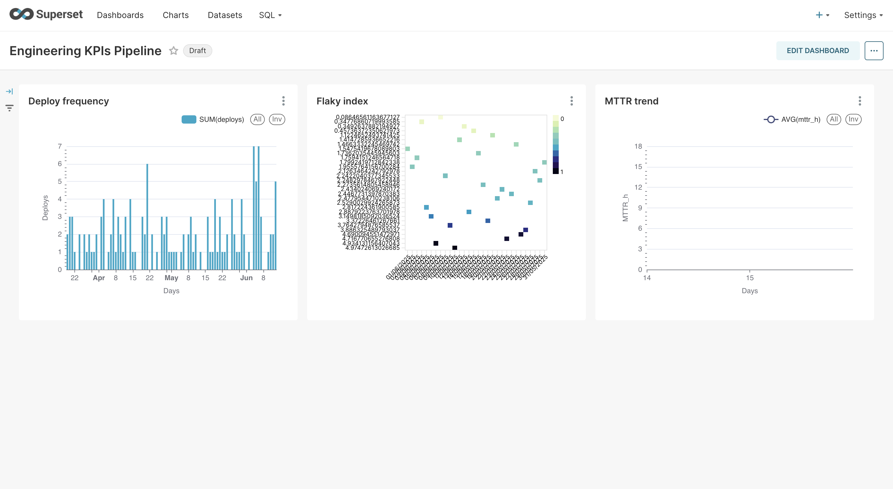
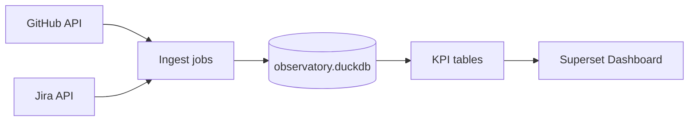

# Engineering KPIs Pipeline

[](https://github.com/MrSanjeeva/Engineering-KPIs-Pipeline/actions/workflows/ci.yml)
[](LICENSE)

Add this when the dashboard is live:
[](https://engineering-kpis-superset.onrender.com)

**Purpose —** Daily-refreshed pipeline that ingests GitHub & Jira activity, stores it in a DuckDB lake, derives DORA+quality KPIs (MTTR, deployment frequency, change-failure rate, flaky-test index), and surfaces them in an Apache Superset dashboard.

---

## Features

- GitHub REST/GraphQL (PRs & builds) – 90‑day look‑back
- Jira Cloud incidents
- **Lake & Modeling**
  - DuckDB single-file database (`data/observatory.duckdb`)
  - Polars/SQL models create KPI tables
- **KPI Suite**
  - Mean Time to Recover (MTTR)
  - Deployment frequency
  - Change-failure rate
  - Flaky-test index
  - Dashboard (Superset)
  - MTTR trend, deploy‑freq bar, 30‑day flaky heatmap – exported as `dash/eng_kpis_dashboard_export.zip`
- **CI / Data refresh**
  - GitHub Actions: unit tests on every push
  - Scheduled 06:05 UTC job regenerates data & KPIs

---

## Quick Start (local)

```bash
git clone https://github.com/MrSanjeeva/Engineering-KPIs-Pipeline.git
cd Engineering-KPIs-Pipeline
python -m venv .venv && source .venv/bin/activate   # Windows: .venv\Scripts\Activate.ps1
pip install -r requirements.txt

# 1 · Auth tokens (set once per shell)
export GH_PAT=xxxxxxxxxxxxxxxxxxxxxxxxxxxx          # GitHub Personal Access Token
export JIRA_BASE=https://<your-site>.atlassian.net   # Jira cloud site
export JIRA_EMAIL=you@example.com                   # Atlassian account email
export JIRA_TOKEN=ATATyourToken12345                # Jira API token

# 2 · Ingest data (90‑day look‑back)
python ingest/github_pull.py
python ingest/jira_pull.py          # optional—skips if creds not set

# 3 · Build DuckDB lake & KPIs
python models/build_kpis.py

# (optional) Import Superset dashboard after container is up
# superset import-dashboards dash/eng_kpis_dashboard_export.zip

# 4 · Explore
duckdb data/observatory.duckdb      # open interactive SQL shell
```

## 📊 Dashboard Screenshots

### Engineering KPIs – Overview



## Live Demo

Superset dashboard hosted at

`https://engineering-kpis-superset.onrender.com`

## Architecture

_Data lineage from API to dashboard_



## Roadmap

- [x] GitHub ingest with unit test
- [x] Jira ingest with unit test
- [x] KPI models in DuckDB (`kpi_daily`, `deploy_freq`, `flaky_index`)
- [x] Superset Docker compose & local dashboard
- [x] Render deploy + README badge
- [x] Automated daily data refresh
- [ ] Viewer profile

## License

This project is licensed under the MIT License
