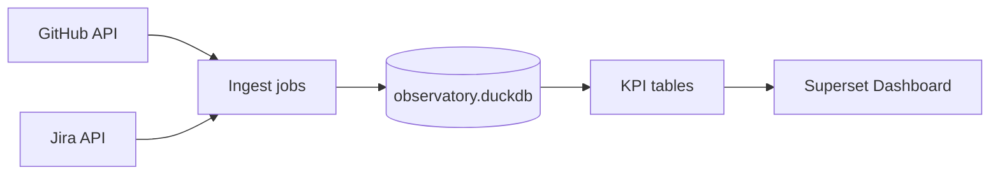

# Engineering KPIs Pipeline

[](https://github.com/MrSanjeeva/Engineering-KPIs-Pipeline/actions/workflows/ci.yml)
[](LICENSE)

<!-- Add this when the dashboard is live:
[](https://eng-kpis.onrender.com)
-->

**Purpose —** Daily-refreshed pipeline that ingests GitHub & Jira activity, stores it in a DuckDB lake, derives DORA+quality KPIs (MTTR, deployment frequency, change-failure rate, flaky-test index), and surfaces them in an Apache Superset dashboard.

---

## Features

- **Data ingest**
  - GitHub REST/GraphQL (PRs & builds) – 90-day look-back
  - Jira Cloud incidents
- **Lake & Modeling**
  - DuckDB single-file database (`data/observatory.duckdb`)
  - Polars/SQL models create KPI tables
- **KPI Suite**
  - Mean Time to Recover (MTTR)
  - Deployment frequency
  - Change-failure rate
  - Flaky-test index
- **Dashboard (Superset)**
  - MTTR trend, deploy-freq bar, flaky heatmap, team radar _(to be deployed)_
  - Public URL on Render free tier
- **CI / Data refresh**
  - GitHub Actions: unit tests on every push
  - Scheduled 06:05 UTC job regenerates data & KPIs

---

## Quick Start (local)

```bash
git clone https://github.com/MrSanjeeva/Engineering-KPIs-Pipeline.git
cd Engineering-KPIs-Pipeline
python -m venv .venv && source .venv/bin/activate
pip install -r requirements.txt

# 1. Set your PAT once per shell
export GITHUB_PAT=ghp_xxxxxxxx

# 2. Ingest GitHub data (90 days)
python ingest/github_pull.py

# 3. Build DuckDB lake & KPIs  (Jira step auto-skips if file not present yet)
python models/build_kpis.py

# 4. Explore
duckdb data/observatory.duckdb  # run SQL
```

## Live Demo

Link to superset dashboard

## Architecture

_Data lineage from API to dashboard_



## License

This project is licensed under the MIT License
